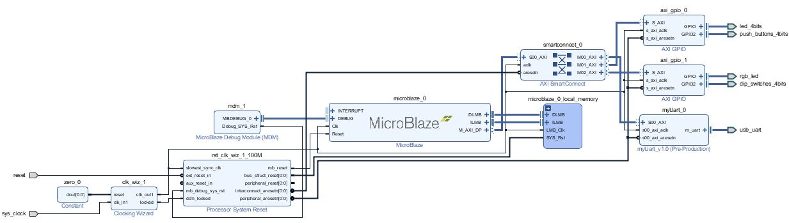

Here is my uart for tasks 1-5.

This uart has configurable clock rate and baud rate.

It uses odd parity.
{assets:inline_js}
  function initialize() {
    var mapCanvas = document.getElementById('map_canvas');
    var mapOptions = {
      center: new google.maps.LatLng(44.5403, -78.5463),
      zoom: 8,
      mapTypeId: google.maps.MapTypeId.ROADMAP
    }
    var map = new google.maps.Map(mapCanvas, mapOptions);
  }
{/assets}

The reciever core will report any errors in the parity of recieved bytes.

Reciever_Core.v

 
<pre><code class="verilog" id="rx_core">
</code></pre>

transmitter_core.v

<pre><code class="verilog" id="tx_core">
</code></pre>

Reciever Test Bench

This test bench tests 50 random cases with some including parity errors.

The design passed all the tests given.

rx_tb.v

<pre><code class="verilog" id="rx_tb">
</code></pre>

Output:

  
<pre><code class="bash">
[1015000ns]Testing 50 random commands
[1015000ns]Testing data_rx = 24 with parity error
[546000000ns]Testing data_rx = 24 with parity error
[1092000000ns]Testing data_rx = 09 with parity error
[1638000000ns]Testing data_rx = 0d with parity error
[2184000000ns]Testing data_rx = 65
[2730000000ns]Testing data_rx = 01 with parity error
[3276000000ns]Testing data_rx = 76 with parity error
[3822000000ns]Testing data_rx = ed
[4368000000ns]Testing data_rx = f9
[4914000000ns]Testing data_rx = c5
[5460000000ns]Testing data_rx = e5 with parity error
[6006000000ns]Testing data_rx = 12 with parity error
[6552000000ns]Testing data_rx = f2
[7098000000ns]Testing data_rx = e8 with parity error
[7644000000ns]Testing data_rx = 5c with parity error
[8190000000ns]Testing data_rx = 2d with parity error
[8736000000ns]Testing data_rx = 63
[9282000000ns]Testing data_rx = 80
[9828000000ns]Testing data_rx = aa with parity error
[10374000000ns]Testing data_rx = 96 with parity error
[10920000000ns]Testing data_rx = 0d with parity error
[11466000000ns]Testing data_rx = 6b with parity error
[12012000000ns]Testing data_rx = 02
[12558000000ns]Testing data_rx = 1d with parity error
[13104000000ns]Testing data_rx = 23
[13650000000ns]Testing data_rx = ca
[14196000000ns]Testing data_rx = f2
[14742000000ns]Testing data_rx = 41
[15288000000ns]Testing data_rx = 78 with parity error
[15834000000ns]Testing data_rx = eb
[16380000000ns]Testing data_rx = c6
[16926000000ns]Testing data_rx = bc
[17472000000ns]Testing data_rx = 0b with parity error
[18018000000ns]Testing data_rx = 85 with parity error
[18564000000ns]Testing data_rx = 3b
[19110000000ns]Testing data_rx = 7e with parity error
[19656000000ns]Testing data_rx = f1 with parity error
[20202000000ns]Testing data_rx = 62
[20748000000ns]Testing data_rx = 9f with parity error
[21294000000ns]Testing data_rx = f8 with parity error
[21840000000ns]Testing data_rx = 9f
[22386000000ns]Testing data_rx = 5b with parity error
[22932000000ns]Testing data_rx = 49
[23478000000ns]Testing data_rx = d7 with parity error
[24024000000ns]Testing data_rx = 96
[24570000000ns]Testing data_rx = c2
[25116000000ns]Testing data_rx = 77 with parity error
[25662000000ns]Testing data_rx = 12
[26208000000ns]Testing data_rx = 6d with parity error
[26754000000ns]Testing data_rx = 1f with parity error
[27300000000ns]50/50 Passed
[27300000000ns]Test Passed
$finish called at time : 27300 us : File "C:/xup/R522/arty_ublaze/arty_ublaze.srcs/sim_1/new/rx_tb.sv" Line 122
</code></pre>

Transmitter Test Bench

This Test bench also tests 50 randoms cases and verifys the design works.

The design passed all the tests given.

tx_tb.sv

<pre><code class="verilog" id="tx_tb">
</code></pre>

Output:

  
<pre><code class="bash">
[1015000ns]Testing 50 random commands
[1015000ns]Testing data_tx = 24
[573900000ns]Testing data_tx = 24
[1146790000ns]Testing data_tx = 81
[1719680000ns]Testing data_tx = 09
[2292570000ns]Testing data_tx = 63
[2865460000ns]Testing data_tx = 0d
[3438350000ns]Testing data_tx = 8d
[4011240000ns]Testing data_tx = 65
[4584130000ns]Testing data_tx = 12
[5157020000ns]Testing data_tx = 01
[5729910000ns]Testing data_tx = 0d
[6302800000ns]Testing data_tx = 76
[6875690000ns]Testing data_tx = 3d
[7448580000ns]Testing data_tx = ed
[8021470000ns]Testing data_tx = 8c
[8594360000ns]Testing data_tx = f9
[9167250000ns]Testing data_tx = c6
[9740140000ns]Testing data_tx = c5
[10313030000ns]Testing data_tx = aa
[10885920000ns]Testing data_tx = e5
[11458810000ns]Testing data_tx = 77
[12031700000ns]Testing data_tx = 12
[12604590000ns]Testing data_tx = 8f
[13177480000ns]Testing data_tx = f2
[13750370000ns]Testing data_tx = ce
[14323260000ns]Testing data_tx = e8
[14896150000ns]Testing data_tx = c5
[15469040000ns]Testing data_tx = 5c
[16041930000ns]Testing data_tx = bd
[16614820000ns]Testing data_tx = 2d
[17187710000ns]Testing data_tx = 65
[17760600000ns]Testing data_tx = 63
[18333490000ns]Testing data_tx = 0a
[18906380000ns]Testing data_tx = 80
[19479270000ns]Testing data_tx = 20
[20052160000ns]Testing data_tx = aa
[20625050000ns]Testing data_tx = 9d
[21197940000ns]Testing data_tx = 96
[21770830000ns]Testing data_tx = 13
[22343720000ns]Testing data_tx = 0d
[22916610000ns]Testing data_tx = 53
[23489500000ns]Testing data_tx = 6b
[24062390000ns]Testing data_tx = d5
[24635280000ns]Testing data_tx = 02
[25208170000ns]Testing data_tx = ae
[25781060000ns]Testing data_tx = 1d
[26353950000ns]Testing data_tx = cf
[26926840000ns]Testing data_tx = 23
[27499730000ns]Testing data_tx = 0a
[28072620000ns]Testing data_tx = ca
[28645510000ns]50/50 Passed
[28645510000ns]Test Passed
$finish called at time : 28645510 ns : File "C:/xup/R522/arty_ublaze/arty_ublaze.srcs/sim_1/new/tx_tb.sv" Line 121
</code></pre>

This is the verilog file that connects the uart to the axi lite bus.

Fifos were included to buffer multiple data bytes.

myUart_v1_0_S00_AXI.v

<pre><code class="verilog" id="axi_bus">
</code></pre>

This is the block diagram of connecting myUart to the Microblaze.

These are the addresses I assigned to all the perpherials.

Here is the c code:

code.c

  
<pre><code class="c">
#include &lt;stdio.h&gt;
#include "platform.h"
#include "xil_printf.h"
#include "xil_io.h"

int main()
{
    init_platform();

    u32 input;
    u32 uart_counter = 0;
    u32 dip_swi = 0;
    u32 send_byte = 0x00;
    Xil_Out32(0x11100004,0x00);

    Xil_Out32(0x11100000,0x1);

    Xil_Out32(0x40000004,0x00);

    while(1){
    	Xil_Out32(0x40000000,uart_counter);
    	dip_swi = Xil_In32(0x11100008);

    	input = Xil_In32(0x44A00008);

    	if((0x1&amp;dip_swi)==0){
    		Xil_Out32(0x11100000,0x1);
    	if(0x100&amp;input){
    		uart_counter++;
    		Xil_Out32(0x44a00004,0x0A);;
    		Xil_Out32(0x44a00004,0x7E);
    		Xil_Out32(0x44a00004,input);
    	}

    	}
    	else
    	{
    		Xil_Out32(0x11100000,0x2);
    		Xil_Out32(0x44a00004,send_byte++);
    		for( int i = 0; i&lt;0xFFFFF;i++);
    	}

    }

    cleanup_platform();
    return 0;
}
</code></pre>

Here is the video of its operation.

)

All the files and (future) build scripts will be included here:
[Github page](https://github.com/AEW2015/522R/tree/master/pages/01.leveling-the-playing-field/task-1-5)