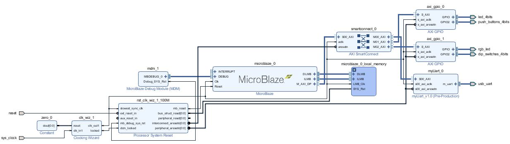
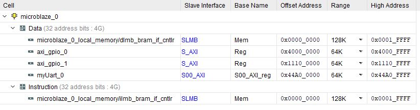

This is my work from the first assignment that used the axilite interface.

This is the axilite ip file that connects the uart to the axi lite bus.

Fifos were included to buffer multiple data bytes.

myUart_v1_0_S00_AXI.v

<pre><code class="verilog">
`timescale 1 ns / 1 ps

	module myUart_v1_0_S00_AXI #
	(
		// Users to add parameters here

		// User parameters ends
		// Do not modify the parameters beyond this line

		// Width of S_AXI data bus
		parameter integer C_S_AXI_DATA_WIDTH	= 32,
		// Width of S_AXI address bus
		parameter integer C_S_AXI_ADDR_WIDTH	= 4
	)
	(
		// Users to add ports here
        (* X_INTERFACE_INFO = "xilinx.com:interface:uart:1.0 m_uart RxD" *)
        input m_rxd, // Serial Input (required)
        (* X_INTERFACE_INFO = "xilinx.com:interface:uart:1.0 m_uart TxD" *)
        output m_txd, // Serial Output (required)
		// User ports ends
		// Do not modify the ports beyond this line

		// Global Clock Signal
		input wire  S_AXI_ACLK,
		// Global Reset Signal. This Signal is Active LOW
		input wire  S_AXI_ARESETN,
		// Write address (issued by master, acceped by Slave)
		input wire [C_S_AXI_ADDR_WIDTH-1 : 0] S_AXI_AWADDR,
		// Write channel Protection type. This signal indicates the
    		// privilege and security level of the transaction, and whether
    		// the transaction is a data access or an instruction access.
		input wire [2 : 0] S_AXI_AWPROT,
		// Write address valid. This signal indicates that the master signaling
    		// valid write address and control information.
		input wire  S_AXI_AWVALID,
		// Write address ready. This signal indicates that the slave is ready
    		// to accept an address and associated control signals.
		output wire  S_AXI_AWREADY,
		// Write data (issued by master, acceped by Slave) 
		input wire [C_S_AXI_DATA_WIDTH-1 : 0] S_AXI_WDATA,
		// Write strobes. This signal indicates which byte lanes hold
    		// valid data. There is one write strobe bit for each eight
    		// bits of the write data bus.    
		input wire [(C_S_AXI_DATA_WIDTH/8)-1 : 0] S_AXI_WSTRB,
		// Write valid. This signal indicates that valid write
    		// data and strobes are available.
		input wire  S_AXI_WVALID,
		// Write ready. This signal indicates that the slave
    		// can accept the write data.
		output wire  S_AXI_WREADY,
		// Write response. This signal indicates the status
    		// of the write transaction.
		output wire [1 : 0] S_AXI_BRESP,
		// Write response valid. This signal indicates that the channel
    		// is signaling a valid write response.
		output wire  S_AXI_BVALID,
		// Response ready. This signal indicates that the master
    		// can accept a write response.
		input wire  S_AXI_BREADY,
		// Read address (issued by master, acceped by Slave)
		input wire [C_S_AXI_ADDR_WIDTH-1 : 0] S_AXI_ARADDR,
		// Protection type. This signal indicates the privilege
    		// and security level of the transaction, and whether the
    		// transaction is a data access or an instruction access.
		input wire [2 : 0] S_AXI_ARPROT,
		// Read address valid. This signal indicates that the channel
    		// is signaling valid read address and control information.
		input wire  S_AXI_ARVALID,
		// Read address ready. This signal indicates that the slave is
    		// ready to accept an address and associated control signals.
		output wire  S_AXI_ARREADY,
		// Read data (issued by slave)
		output wire [C_S_AXI_DATA_WIDTH-1 : 0] S_AXI_RDATA,
		// Read response. This signal indicates the status of the
    		// read transfer.
		output wire [1 : 0] S_AXI_RRESP,
		// Read valid. This signal indicates that the channel is
    		// signaling the required read data.
		output wire  S_AXI_RVALID,
		// Read ready. This signal indicates that the master can
    		// accept the read data and response information.
		input wire  S_AXI_RREADY
	);

	// AXI4LITE signals
	reg [C_S_AXI_ADDR_WIDTH-1 : 0] 	axi_awaddr;
	reg  	axi_awready;
	reg  	axi_wready;
	reg [1 : 0] 	axi_bresp;
	reg  	axi_bvalid;
	reg [C_S_AXI_ADDR_WIDTH-1 : 0] 	axi_araddr;
	reg  	axi_arready;
	reg [C_S_AXI_DATA_WIDTH-1 : 0] 	axi_rdata;
	reg [1 : 0] 	axi_rresp;
	reg  	axi_rvalid;

	// Example-specific design signals
	// local parameter for addressing 32 bit / 64 bit C_S_AXI_DATA_WIDTH
	// ADDR_LSB is used for addressing 32/64 bit registers/memories
	// ADDR_LSB = 2 for 32 bits (n downto 2)
	// ADDR_LSB = 3 for 64 bits (n downto 3)
	localparam integer ADDR_LSB = (C_S_AXI_DATA_WIDTH/32) + 1;
	localparam integer OPT_MEM_ADDR_BITS = 1;
	//----------------------------------------------
	//-- Signals for user logic register space example
	//------------------------------------------------
	//-- Number of Slave Registers 4
	reg [C_S_AXI_DATA_WIDTH-1:0]	slv_reg0;
	reg [C_S_AXI_DATA_WIDTH-1:0]	slv_reg1;
	reg [C_S_AXI_DATA_WIDTH-1:0]	slv_reg2;
	reg [C_S_AXI_DATA_WIDTH-1:0]	slv_reg3;
	wire	 slv_reg_rden;
	wire	 slv_reg_wren;
	reg [C_S_AXI_DATA_WIDTH-1:0]	 reg_data_out;
	integer	 byte_index;
	reg	 aw_en;
	reg [31:0] error_counter; 
	wire [31:0] error_counter_next; 

	
	wire rec_data,err_data;
    wire [7:0] data_rx;
    wire rx_busy;
	wire send_data;
    wire [7:0] data_tx;
    wire tx_busy;
    
    
    wire tx_fifo_empty,tx_fifo_full;
    wire tx_fifo_rd,tx_fifo_wr;
    
    
    wire rx_fifo_empty,rx_fifo_full;
    wire rx_fifo_rd,rx_fifo_wr;
    
    wire [7:0] data_rx_out;
	
	
	
	// I/O Connections assignments
	
	

	assign S_AXI_AWREADY	= axi_awready;
	assign S_AXI_WREADY	= axi_wready;
	assign S_AXI_BRESP	= axi_bresp;
	assign S_AXI_BVALID	= axi_bvalid;
	assign S_AXI_ARREADY	= axi_arready;
	assign S_AXI_RDATA	= axi_rdata;
	assign S_AXI_RRESP	= axi_rresp;
	assign S_AXI_RVALID	= axi_rvalid;
	// Implement axi_awready generation
	// axi_awready is asserted for one S_AXI_ACLK clock cycle when both
	// S_AXI_AWVALID and S_AXI_WVALID are asserted. axi_awready is
	// de-asserted when reset is low.

	always @( posedge S_AXI_ACLK )
	begin
	  if ( S_AXI_ARESETN == 1'b0 )
	    begin
	      axi_awready &lt;= 1'b0;
	      aw_en &lt;= 1'b1;
	    end 
	  else
	    begin    
	      if (~axi_awready &amp;&amp; S_AXI_AWVALID &amp;&amp; S_AXI_WVALID &amp;&amp; aw_en)
	        begin
	          // slave is ready to accept write address when 
	          // there is a valid write address and write data
	          // on the write address and data bus. This design 
	          // expects no outstanding transactions. 
	          axi_awready &lt;= 1'b1;
	          aw_en &lt;= 1'b0;
	        end
	        else if (S_AXI_BREADY &amp;&amp; axi_bvalid)
	            begin
	              aw_en &lt;= 1'b1;
	              axi_awready &lt;= 1'b0;
	            end
	      else           
	        begin
	          axi_awready &lt;= 1'b0;
	        end
	    end 
	end       

	// Implement axi_awaddr latching
	// This process is used to latch the address when both 
	// S_AXI_AWVALID and S_AXI_WVALID are valid. 

	always @( posedge S_AXI_ACLK )
	begin
	  if ( S_AXI_ARESETN == 1'b0 )
	    begin
	      axi_awaddr &lt;= 0;
	    end 
	  else
	    begin    
	      if (~axi_awready &amp;&amp; S_AXI_AWVALID &amp;&amp; S_AXI_WVALID &amp;&amp; aw_en)
	        begin
	          // Write Address latching 
	          axi_awaddr &lt;= S_AXI_AWADDR;
	        end
	    end 
	end       

	// Implement axi_wready generation
	// axi_wready is asserted for one S_AXI_ACLK clock cycle when both
	// S_AXI_AWVALID and S_AXI_WVALID are asserted. axi_wready is 
	// de-asserted when reset is low. 

	always @( posedge S_AXI_ACLK )
	begin
	  if ( S_AXI_ARESETN == 1'b0 )
	    begin
	      axi_wready &lt;= 1'b0;
	    end 
	  else
	    begin    
	      if (~axi_wready &amp;&amp; S_AXI_WVALID &amp;&amp; S_AXI_AWVALID &amp;&amp; aw_en )
	        begin
	          // slave is ready to accept write data when 
	          // there is a valid write address and write data
	          // on the write address and data bus. This design 
	          // expects no outstanding transactions. 
	          axi_wready &lt;= 1'b1;
	        end
	      else
	        begin
	          axi_wready &lt;= 1'b0;
	        end
	    end 
	end       

	// Implement memory mapped register select and write logic generation
	// The write data is accepted and written to memory mapped registers when
	// axi_awready, S_AXI_WVALID, axi_wready and S_AXI_WVALID are asserted. Write strobes are used to
	// select byte enables of slave registers while writing.
	// These registers are cleared when reset (active low) is applied.
	// Slave register write enable is asserted when valid address and data are available
	// and the slave is ready to accept the write address and write data.
	assign slv_reg_wren = axi_wready &amp;&amp; S_AXI_WVALID &amp;&amp; axi_awready &amp;&amp; S_AXI_AWVALID;

	always @( posedge S_AXI_ACLK )
	begin
	  if ( S_AXI_ARESETN == 1'b0 )
	    begin
	      slv_reg0 &lt;= 0;
	      slv_reg1 &lt;= 0;
	      slv_reg2 &lt;= 0;
	      slv_reg3 &lt;= 0;
	    end 
	  else begin
	    if (slv_reg_wren)
	      begin
	        case ( axi_awaddr[ADDR_LSB+OPT_MEM_ADDR_BITS:ADDR_LSB] )
	          2'h0:
	            for ( byte_index = 0; byte_index &lt;= (C_S_AXI_DATA_WIDTH/8)-1; byte_index = byte_index+1 )
	              if ( S_AXI_WSTRB[byte_index] == 1 ) begin
	                // Respective byte enables are asserted as per write strobes 
	                // Slave register 0
	                slv_reg0[(byte_index*8) +: 8] &lt;= S_AXI_WDATA[(byte_index*8) +: 8];
	              end  
	          2'h1:
	            for ( byte_index = 0; byte_index &lt;= (C_S_AXI_DATA_WIDTH/8)-1; byte_index = byte_index+1 )
	              if ( S_AXI_WSTRB[byte_index] == 1 ) begin
	                // Respective byte enables are asserted as per write strobes 
	                // Slave register 1
	                slv_reg1[(byte_index*8) +: 8] &lt;= S_AXI_WDATA[(byte_index*8) +: 8];
	              end  
	          2'h2:
	            for ( byte_index = 0; byte_index &lt;= (C_S_AXI_DATA_WIDTH/8)-1; byte_index = byte_index+1 )
	              if ( S_AXI_WSTRB[byte_index] == 1 ) begin
	                // Respective byte enables are asserted as per write strobes 
	                // Slave register 2
	                slv_reg2[(byte_index*8) +: 8] &lt;= S_AXI_WDATA[(byte_index*8) +: 8];
	              end  
	          2'h3:
	            for ( byte_index = 0; byte_index &lt;= (C_S_AXI_DATA_WIDTH/8)-1; byte_index = byte_index+1 )
	              if ( S_AXI_WSTRB[byte_index] == 1 ) begin
	                // Respective byte enables are asserted as per write strobes 
	                // Slave register 3
	                slv_reg3[(byte_index*8) +: 8] &lt;= S_AXI_WDATA[(byte_index*8) +: 8];
	              end  
	          default : begin
	                      slv_reg0 &lt;= slv_reg0;
	                      slv_reg1 &lt;= slv_reg1;
	                      slv_reg2 &lt;= slv_reg2;
	                      slv_reg3 &lt;= slv_reg3;
	                    end
	        endcase
	      end
	  end
	end    

	// Implement write response logic generation
	// The write response and response valid signals are asserted by the slave 
	// when axi_wready, S_AXI_WVALID, axi_wready and S_AXI_WVALID are asserted.  
	// This marks the acceptance of address and indicates the status of 
	// write transaction.

	always @( posedge S_AXI_ACLK )
	begin
	  if ( S_AXI_ARESETN == 1'b0 )
	    begin
	      axi_bvalid  &lt;= 0;
	      axi_bresp   &lt;= 2'b0;
	    end 
	  else
	    begin    
	      if (axi_awready &amp;&amp; S_AXI_AWVALID &amp;&amp; ~axi_bvalid &amp;&amp; axi_wready &amp;&amp; S_AXI_WVALID)
	        begin
	          // indicates a valid write response is available
	          axi_bvalid &lt;= 1'b1;
	          axi_bresp  &lt;= 2'b0; // 'OKAY' response 
	        end                   // work error responses in future
	      else
	        begin
	          if (S_AXI_BREADY &amp;&amp; axi_bvalid) 
	            //check if bready is asserted while bvalid is high) 
	            //(there is a possibility that bready is always asserted high)   
	            begin
	              axi_bvalid &lt;= 1'b0; 
	            end  
	        end
	    end
	end   

	// Implement axi_arready generation
	// axi_arready is asserted for one S_AXI_ACLK clock cycle when
	// S_AXI_ARVALID is asserted. axi_awready is 
	// de-asserted when reset (active low) is asserted. 
	// The read address is also latched when S_AXI_ARVALID is 
	// asserted. axi_araddr is reset to zero on reset assertion.

	always @( posedge S_AXI_ACLK )
	begin
	  if ( S_AXI_ARESETN == 1'b0 )
	    begin
	      axi_arready &lt;= 1'b0;
	      axi_araddr  &lt;= 32'b0;
	    end 
	  else
	    begin    
	      if (~axi_arready &amp;&amp; S_AXI_ARVALID)
	        begin
	          // indicates that the slave has acceped the valid read address
	          axi_arready &lt;= 1'b1;
	          // Read address latching
	          axi_araddr  &lt;= S_AXI_ARADDR;
	        end
	      else
	        begin
	          axi_arready &lt;= 1'b0;
	        end
	    end 
	end       

	// Implement axi_arvalid generation
	// axi_rvalid is asserted for one S_AXI_ACLK clock cycle when both 
	// S_AXI_ARVALID and axi_arready are asserted. The slave registers 
	// data are available on the axi_rdata bus at this instance. The 
	// assertion of axi_rvalid marks the validity of read data on the 
	// bus and axi_rresp indicates the status of read transaction.axi_rvalid 
	// is deasserted on reset (active low). axi_rresp and axi_rdata are 
	// cleared to zero on reset (active low).  
	always @( posedge S_AXI_ACLK )
	begin
	  if ( S_AXI_ARESETN == 1'b0 )
	    begin
	      axi_rvalid &lt;= 0;
	      axi_rresp  &lt;= 0;
	    end 
	  else
	    begin    
	      if (axi_arready &amp;&amp; S_AXI_ARVALID &amp;&amp; ~axi_rvalid)
	        begin
	          // Valid read data is available at the read data bus
	          axi_rvalid &lt;= 1'b1;
	          axi_rresp  &lt;= 2'b0; // 'OKAY' response
	        end   
	      else if (axi_rvalid &amp;&amp; S_AXI_RREADY)
	        begin
	          // Read data is accepted by the master
	          axi_rvalid &lt;= 1'b0;
	        end                
	    end
	end    

	// Implement memory mapped register select and read logic generation
	// Slave register read enable is asserted when valid address is available
	// and the slave is ready to accept the read address.
	assign slv_reg_rden = axi_arready &amp; S_AXI_ARVALID &amp; ~axi_rvalid;
	always @(*)
	begin
	      // Address decoding for reading registers
	      case ( axi_araddr[ADDR_LSB+OPT_MEM_ADDR_BITS:ADDR_LSB] )
	        2'h0   : reg_data_out = {31'd0,!tx_fifo_full};
	        2'h1   : reg_data_out = slv_reg1;
	        2'h2   : reg_data_out = {23'd0,!rx_fifo_empty,data_rx_out};
	        2'h3   : reg_data_out = error_counter;
	        default : reg_data_out = 0;
	      endcase
	end

	// Output register or memory read data
	always @( posedge S_AXI_ACLK )
	begin
	  if ( S_AXI_ARESETN == 1'b0 )
	    begin
	      axi_rdata  &lt;= 0;
	    end 
	  else
	    begin    
	      // When there is a valid read address (S_AXI_ARVALID) with 
	      // acceptance of read address by the slave (axi_arready), 
	      // output the read dada 
	      if (slv_reg_rden)
	        begin
	          axi_rdata &lt;= reg_data_out;     // register read data
	        end   
	    end
	end    

	// Add user logic here
    
    rx_core(S_AXI_ACLK,S_AXI_ARESETN,m_rxd,rec_data,err_data,rx_busy,data_rx);
    tx_core(S_AXI_ACLK,S_AXI_ARESETN,send_data,data_tx,m_txd,tx_busy);
	
	assign send_data = ! tx_fifo_empty &amp;&amp; ! tx_busy;
	assign tx_fifo_rd = ! tx_fifo_empty &amp;&amp; ! tx_busy;
	assign tx_fifo_wr = (slv_reg_wren &amp;&amp; axi_awaddr[ADDR_LSB+OPT_MEM_ADDR_BITS:ADDR_LSB] == 2'h1) ? 1 : 0;
	
	fifo_generator_0 tx_fifo (
      .clk(S_AXI_ACLK),      // input wire clk
      .din(S_AXI_WDATA[7:0]),      // input wire [7 : 0] din
      .wr_en(tx_fifo_wr),  // input wire wr_en
      .rd_en(tx_fifo_rd),  // input wire rd_en
      .dout(data_tx),    // output wire [7 : 0] dout
      .full(tx_fifo_full),    // output wire full
      .empty(tx_fifo_empty)  // output wire empty
    );
    
    assign rx_fifo_rd = (slv_reg_rden &amp;&amp; axi_araddr[ADDR_LSB+OPT_MEM_ADDR_BITS:ADDR_LSB] == 2'h2) ? 1 : 0;
    
    fifo_generator_0 rx_fifo (
      .clk(S_AXI_ACLK),      // input wire clk
      .din(data_rx),      // input wire [7 : 0] din
      .wr_en(rec_data),  // input wire wr_en
      .rd_en(rx_fifo_rd),  // input wire rd_en
      .dout(data_rx_out),    // output wire [7 : 0] dout
      .full(rx_fifo_full),    // output wire full
      .empty(rx_fifo_empty)  // output wire empty
    );

	always @( posedge S_AXI_ACLK )
	begin
	  if ( S_AXI_ARESETN == 1'b0 )
        error_counter &lt;= 0;
	  else
       error_counter &lt;= error_counter_next;
	end     
	
	assign error_counter_next = (err_data==1'b1) ? error_counter+1 : error_counter;
	// User logic ends

	endmodule
</code></pre>

This is the block diagram of connecting myUart to the Microblaze.

These are the addresses I assigned to all the perpherials.

The microblaze code allows for two modes.
 * Mode one (BLUE LED) echos all characters recieved. The leds keep count of characters recieved.
 * Mode two (GREEN LED) transmits all possible character sequentially

code.c

<pre><code class="c">
#include &lt;stdio.h&gt;
#include "platform.h"
#include "xil_printf.h"
#include "xil_io.h"

int main()
{
    init_platform();

    u32 input;
    u32 uart_counter = 0;
    u32 dip_swi = 0;
    u32 send_byte = 0x00;
    Xil_Out32(0x11100004,0x00);

    Xil_Out32(0x11100000,0x1);

    Xil_Out32(0x40000004,0x00);

    while(1){
    	Xil_Out32(0x40000000,uart_counter);
    	dip_swi = Xil_In32(0x11100008);

    	input = Xil_In32(0x44A00008);

    	if((0x1&amp;dip_swi)==0){
    		Xil_Out32(0x11100000,0x1);
    	if(0x100&amp;input){
    		uart_counter++;
    		Xil_Out32(0x44a00004,0x0A);;
    		Xil_Out32(0x44a00004,0x7E);
    		Xil_Out32(0x44a00004,input);
    	}

    	}
    	else
    	{
    		Xil_Out32(0x11100000,0x2);
    		Xil_Out32(0x44a00004,send_byte++);
    		for( int i = 0; i&lt;0xFFFFF;i++);
    	}

    }

    cleanup_platform();
    return 0;
}
</code></pre>

Here is the video of its operation.

)

All the files and (future) build scripts will be included here:
[Github page](https://github.com/AEW2015/522R/tree/master/pages/01.leveling-the-playing-field/task-6-7)