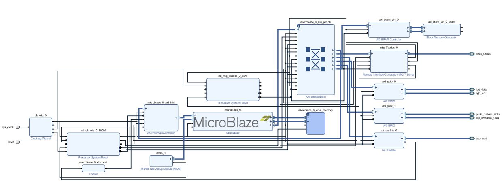
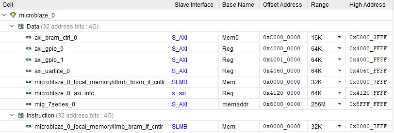

Here is my bram test.

This is the block diagram of connecting the bram to the Microblaze.

These are the addresses I assigned to all the perpherials.

code.c

<pre><code class="c">
#include &lt;stdio.h&gt;
#include "platform.h"
#include "xil_printf.h"
#include "xil_io.h"

#define LEDS_DATA 0x40000000
#define LEDS_TRI  0x40000004
#define RGB_DATA  0x40000008
#define RGB_TRI   0x4000000C

#define BTN_DATA  0x40010000
#define DIP_DATA  0x40010008

#define BRAMSIZE 8
unsigned int * brambase = (unsigned int *)0xc0000000;

#define PRINT xil_printf

unsigned int index_t;

int main()
{
    init_platform();

    print("Hello World\n\r");
    //tri state for leds
    Xil_Out32(LEDS_TRI,0x00);
    Xil_Out32(RGB_TRI,0x00);

    u32 btn_read = 0;
    u32 dip_read = 0;
    u32 rgb_write = 0;

    PRINT("Writing to memory\n\r");

    for(index_t=0; index_t&lt;BRAMSIZE; index_t++)
      {
	*(brambase+index_t) = index_t+1;
	PRINT("Write %d at location %d = %X\n\r",index_t+1,index_t,brambase+index_t);

      }

    PRINT("\n\rReading from memory and checking\n\r");

    for(index_t=0; index_t&lt;BRAMSIZE; index_t++)
    {
      PRINT("Read %d at location %d = %X\n\r",*(brambase+index_t),index_t,brambase+index_t);

    }

    PRINT("Done reading BRAM, start polling switches\n\r");

    while (1){
    	btn_read = Xil_In32(BTN_DATA);
    	Xil_Out32(LEDS_DATA,btn_read);

    	dip_read = Xil_In32(DIP_DATA);
    	rgb_write = 0x7 &amp; dip_read;
    	rgb_write = rgb_write &lt;&lt; 3 | rgb_write;
    	rgb_write = rgb_write &lt;&lt; 6 | rgb_write;
    	Xil_Out32(RGB_DATA,rgb_write);
    }

    cleanup_platform();

    return 0;
}
</code></pre>

Here is the video of its operation.

)

All the files and (future) build scripts will be included here:
[Github page](https://github.com/AEW2015/522R/tree/master/pages/02.microblaze-system/bram-test)
