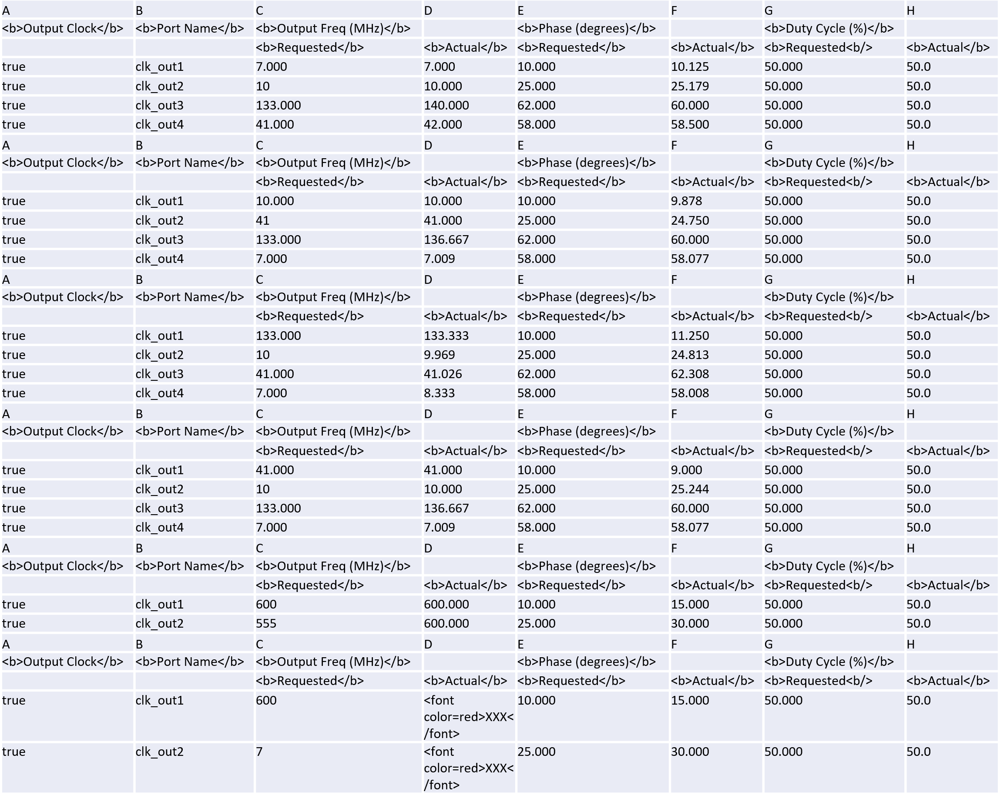

Basic Clock Generation, On-chip Feedback

Clock block diagram

This block diagram matches the PLLE2_ADV in Figure 3-5 in ug472.

The Input clk was multiplied by 41 and divided by 5 to get a VCO of 820 MHz.
This VCO was divided by 82 to get an output clk of 10 MHz.

The output clks can be determined by the generics  for the PLL.
The VCO must be between 800 MHz to 1600 MHz.
The VCO is generated from an input clk by applying the CLKFBOUT_MULT and the DIVCLK_DIVIDE.
This one VCO feed the rest of the output clks by applying this CLKOUT*_DIVIDE  value per output clk.

CLKOUT0 = ((CLKIN * CLKFBOUT_MULT)/DIVCLK_DIVIDE)/CLKOUT0_DIVIDE

CLKOUT1 = ((CLKIN * CLKFBOUT_MULT)/DIVCLK_DIVIDE)/CLKOUT1_DIVIDE

CLKOUT2 = ((CLKIN * CLKFBOUT_MULT)/DIVCLK_DIVIDE)/CLKOUT2_DIVIDE

CLKOUT3 = ((CLKIN * CLKFBOUT_MULT)/DIVCLK_DIVIDE)/CLKOUT3_DIVIDE

CLKOUT4 = ((CLKIN * CLKFBOUT_MULT)/DIVCLK_DIVIDE)/CLKOUT4_DIVIDE

CLKOUT5 = ((CLKIN * CLKFBOUT_MULT)/DIVCLK_DIVIDE)/CLKOUT5_DIVIDE

For the MCM, the CLKFBOUT_MULT can 2 to 64 or 2.000 to 64.000 in increments of 0.125.
Assuming they are using fixed point.
The PLL can only do integers from 2 to 64.

The MCMM DIVCLK_DIVIDE is 1 to 106 and PLL DIVCLK_DIVIDE is 1 to 56.

CLKOUT*_DIVIDE go to 1 to 128.

The MCMM does have a CLKOUT0_DIVIDE_F can 2 to 128 or 2.000 to 64.000 in increments of 0.125.

All the clocks are based on one VCO and any combination of outputs may not be possible.
The clocking wizard will try to give the best solution if possible or not work at all.

Such combinations as a 500 Mhz input clk, and a 600 Mhz and 550 Mhz output clks will result in two 600 Mhz Output clks.
Or a 500 Mhz input clk, and a 600 Mhz and 7 Mhz output clks will be impossible and the tools will not allow it.

The first clock in the clocking wizard get proirty in generating the VCO.
All other clocks are generated from that VCO.
The first clock should be the most important or hardest to get.
Or just rotating the clocks in the first position will get you different varitions of acutal output clk speeds.

Basic Clock Generation, On-chip Feedback, Fixed Phase Shifting

The Phase is dependent on the give frequency of the VCO and the main clock divide chosen.

This is confirmed by ug472.
CLKOUT[0:6]_PHASE is a real number between –360.000 to 360.000 in increments of 1/56 the FVCO and/or increments depending on CLKOUT_DIVIDE.
Each clock out can have its own phase shift.

