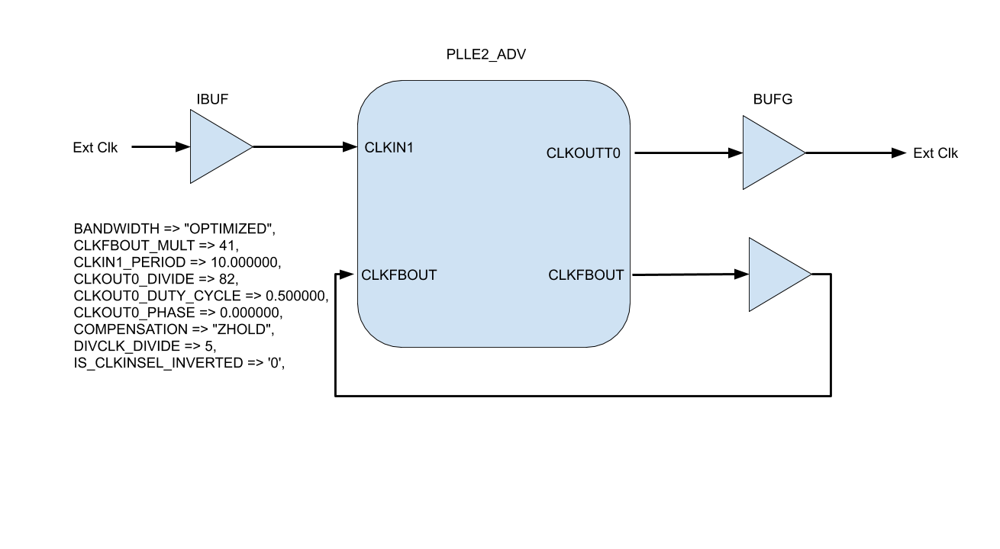

Clock block diagram

This block diagram matches the PLLE2_ADV in Figure 3-5 in ug472.

The Input clk was multiplied by 41 and divided by 5 to get a VCO of 820 MHz.
This VCO was divided by 82 to get an output clk of 10 MHz.

The output clks can be determined by the generics  for the PLL.
The VCO must be between 800 MHz to 1600 MHz.
The VCO is generated from an input clk by applying the CLKFBOUT_MULT and the DIVCLK_DIVIDE.
This one VCO feed the rest of the output clks by applying this CLKOUT*_DIVIDE  value per output clk.

CLKOUT0 = ((CLKIN * CLKFBOUT_MULT)/DIVCLK_DIVIDE)/CLKOUT0_DIVIDE

CLKOUT1 = ((CLKIN * CLKFBOUT_MULT)/DIVCLK_DIVIDE)/CLKOUT1_DIVIDE

CLKOUT2 = ((CLKIN * CLKFBOUT_MULT)/DIVCLK_DIVIDE)/CLKOUT2_DIVIDE

CLKOUT3 = ((CLKIN * CLKFBOUT_MULT)/DIVCLK_DIVIDE)/CLKOUT3_DIVIDE

CLKOUT4 = ((CLKIN * CLKFBOUT_MULT)/DIVCLK_DIVIDE)/CLKOUT4_DIVIDE

CLKOUT5 = ((CLKIN * CLKFBOUT_MULT)/DIVCLK_DIVIDE)/CLKOUT5_DIVIDE