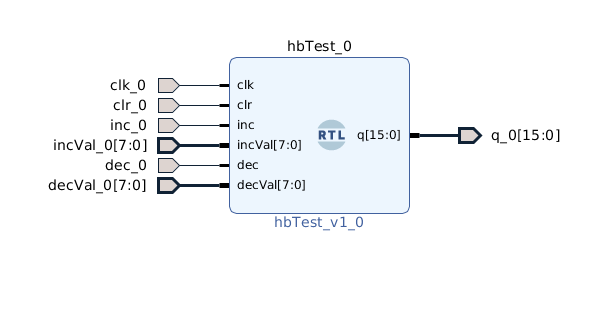
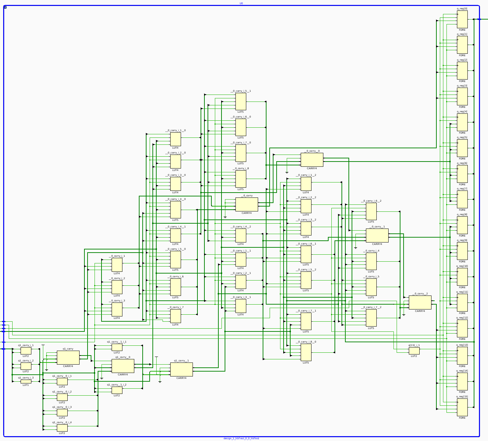
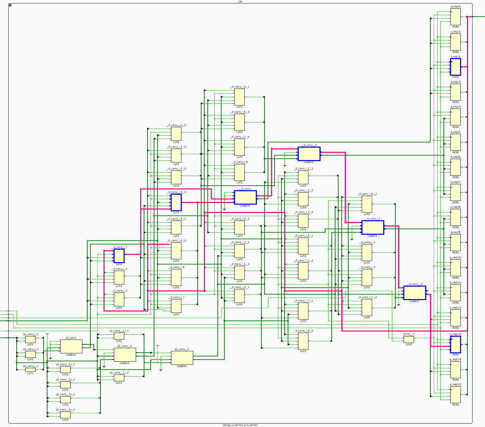

#Timing Lab

##Andy and Jennings

##Part 1

###Summary

Create a 16 bit wide counter with the defualt clock and review the timing report.
Find the critical path and examine the parts of the path.

###Code

counter.v

 
<pre><code class="verilog">
`timescale 1ns / 1ps
module hbTest #(parameter OUTPUT_WIDTH = 16, parameter INCVAL_MULTIPLIER = 3)(input clk, input clr, input inc, input [7:0] incVal, input dec, input [7:0] decVal, output reg [OUTPUT_WIDTH - 1:0] q);
    always @(posedge clk)
    begin
        if(clr == 1'b1)
        begin
            q &lt;= 0;
        end
        else if(inc == 1'b1)
        begin
            q &lt;= q + {{8{incVal[7]}}, incVal[7:0]} * INCVAL_MULTIPLIER;
        end
        else if(dec == 1'b1)
        begin
            q &lt;= q - {{8{decVal[7]}}, decVal[7:0]};
        end
        else
        begin
            q &lt;= q;
        end
    end
endmodule
</code></pre>

###Steps:

A diagram of both the top level design and the inside of the counter block.

The right side of the circuit is the flipflops storing the counter.
The bottom left is the multiplir for the incval.
The center of the circuit is the adder logic with the carry chain.

Do you understand why the synthesis tool did what it did and how it implmenets your circuit?

Yes, we followed the control signals and understand how the cirucit decides between clearing, incrementing, decrementing, and maintaining the current value.

Bring up timing report and find critical path and draw it on the diagram.

The critical path is the carry chain.

###Questions:

Q:What is its slack and what does that mean?

A:The slack is 6.428. Slack is the amount of extra time the Data path has before violating tSetup. A postive slack means you can go faster. A zero slack means you are going the fastest possible.
A Negative Slack mean your design does not meet timing and violates tSetup. So we could reduce the clock period by 6.428ns and still meet timing.

What is the launch edge (beginning) of the path? 

A:FDRE(q_reg[2])

When does the clock edge that launches the signal arrive at the launch flip flop? 
A:The clock arrives at 2.140ns.

What is the capture point (end) of the path? When does the clock arrive there? Does this make sense knowing what you know about the path from the input pin to the flip flops? 

A:The capture point is FDRE(q_reg[13]). The clock arrives there at 5.530ns. 

When is the signal required to be at the endpoint? 

A:At 11.958ns.

If you do the arithmetic, how do the various numbers work out? Do the values above take into account clock skew or not?

A:Subtracting the difference of the data arriving at the capture flip flop(5.530) from the required capture point flip flop(11.958) which gives us the slack of 6.428ns. Yes, it takes the clock skew into account in the required time to get to the capture flip flop.

What are the various delays making up the critical path? Which ones dominate? Which ones are smaller than you might have anticipated? Any surprises here?

A:The first flip flop's delay is 1.134ns, LUT4's delay is .965ns, LUT5's delay is .327ns, the first CARRY4's delay is .401ns, the second CARRY4's delay is .114ns, the third CARRY4's delay is .114ns, the last CARRY$'s delay is .334ns. The first flip flop and first LUT dominate, adding the largest delay. The CARRY4 delays were smaller than we thought they would be. We were surprised at the difference in delays between the two LUTs as well as the four CARRY4s.

##Part 2

###Summary 

Add a PLL to the design and see the change in timing.

###Questions:

How does adding the PLL change things that you see in the synthesized circuit and in the timing report? Explain. 

A:It uses the feedback loop to shift the clock signal so that there is a zero delay clock. It makes it so the clock arrives at the launch flip flop (q-reg[2]) at -4.836ns so that it can arrive at the capture flip-flop at .397ns giving us 5.233ns from launch to capture. We are required to get to the capture at 6.944ns so our new slack is (6.944 - .397) 6.547ns which is slightly better than the slack without the PLL.

Do the actual path delays change or is the time scale simply shifted and by how much? 

A:The path delays do not change, the time scale is shifted (by -9.006ns).

Can you make sense of this based on the clock path? 

A:Yes.

##Part 3

###Summary

Change the counter to be 64 bits wide and rerun.
Find the max bit size for the given clock frequency.

###Questions

Based on what you see, how wide of a counter do you estimate would work at this clock rate? 

A:246 bits, this is dependent on the CARRY4 delays which for the high majority is .114ns.

Other than having a longer worst case combinational path, does having a much longer counter affect anything else you see in this timing report? Can you explain this?

A:Slightly longer net rounting delays. Yes, the tools are taking the output up to the beginning LUT (longest delay) and then chainning the carry chains back to back to get back to the output making it so there is almost no routing delay between the carry chains.

##Part 4

###Summary
Set an input delay for the LSB of the incVal and an output delay for the MSB of the q. Look at the timing report.

###Questions:

Range of Input/Output Delays that work:

Input: 1.5ns Output: 0ns; This is the max input delay with output set to 0.

Input: 0ns Output: 7.97ns; This is the max output delay with input set to 0.

Input: 1.5ns Output: 6.25ns; This is the max output delay with the input set to 1.5ns (max).

Input: 0.25ns Output: 7.97ns This is the max input delay with the output set to 7.97ns (max).

Input: 0.5ns Output: 7.95ns; This is an example of an input in range that meets timing.

Q:What is an input delay? 

A: This helps the tool understand the time between the edge of the input to the next flipflop.

Q.What is an output delay? 

A: This helps the tool understand the time between the last flipflop to the external output capture device.

With these new assumptions, is your PLL set up correctly or do you see something you should do to it to make the whole board-level design work better? 

For example, would changing the phase of the PLL for your internal circuitry help in any way? 

If you decide something should be done, you need not do it, but simply explain what you would do and why you would do it.

##Part 5

###Summary

Modify the constraints and determine the maximum frequency.

###Questions:

In the end, what is the limiting factor? 

A:We found that the max frequency we could run was 210 MHz with an input delay of 0ns and an output delay of 0ns. The limiting factor was the carry chain logic again.

How much of the final critical path is Tclk-Q, Tlogic, Tsetup, Twiring, and Tskew? 
	
	Tclk-Q:0.456ns

	Tlogic:3.268ns (71.5% of critical path)
	
	Twiring:1.301ns (28.5% of critical path)
	
	Tskew:-0.049ns 
	
	Tsetup:0.062ns
	
	Total Critical Path:4.569ns

##Final Summary

This project demonstrates that we can use and understand the timing reports of the Vivado tools.
This should in future projects to improve the our design results.

(a) did you do everything requested? 

yes

(b) does your writeup evidence that you have figured out the basics of the timing report, the use of PLL's in this scenario, and the use of clock/input/output constraints?

yes
