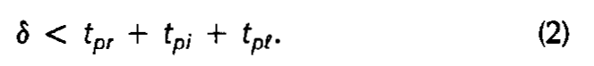
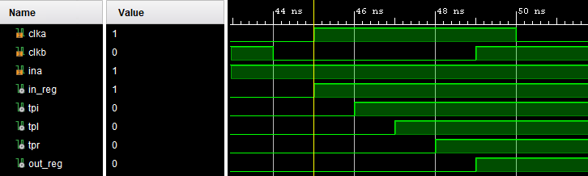
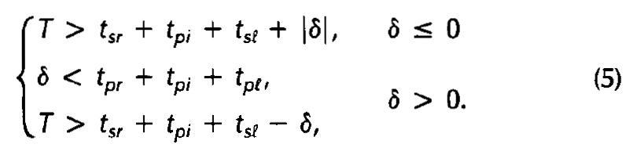
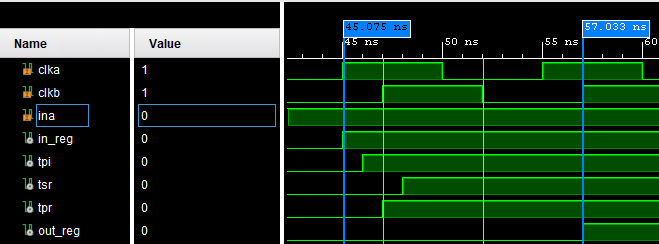
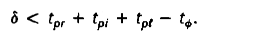
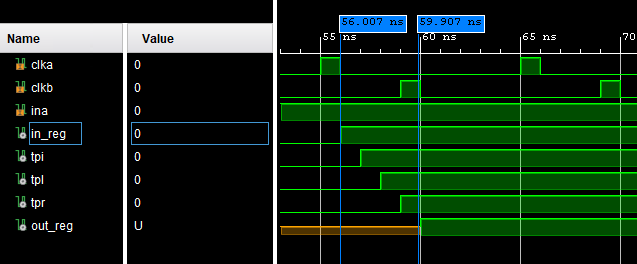

#Clock Skew

##Introduction

###Block Diagram

##Edge Triggered Clocking

###Min Delay

####Waveform

###Max Delay

####Waveform

##Signle-Phase Clocking

###Min Delay

####Waveform

###Max Delay

####Waveform

##Conclusion