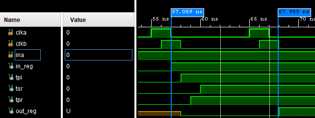

#Clock Skew

##Introduction

This assignment was hard to understand what the expectations were.
The paper provided simple equations to explain the affect the of clock skew of on a pipelined system.
Skew will not necessarily hinder the timing of a design and can even provide additional wiggle room in some situations.
Look at the block diagram below, there is two flip-flips that are triggered by the same clk.
The clock arrives at different times at each flip-flop according to the clock skew.
If this clock skew has too great of positive or negative value, the flip-flop may enter metastability or record the wrong value.

###Block Diagram

##Edge Triggered Clocking

The first set of examples will look at the edge triggered clocking system.
This system triggers the flip-flops on the rising edge of the clock signal.

###Max Delay

The max positive delay that a clock skew can cause is according to the propagation time of the signal.
If the in_reg flip-flop is triggered, the output will start to flow from that flip-flop through the combinational logic to the next flip-flop.
If the new value reaches the next flip-flop before clkb reaches the out_reg flip-flop, an incorrect value will be recorded.
The equation below shows the upper limit of the skew.

####Waveform

As you can see in this waveform, there is a skew of 4ns.
This is longer than the total propagation delay which is 3ns.
This causes the out_reg to latch on the wrong data.

###Min Delay

The min delay is the maximum negative skew that the system can tolerate.
As the negative skew increases in magnitude, there is less slack to meet the setup time which consists of the settling time of the logic and register, and the propagation time of the wire.
The equation below shows the bounds for the clock skew in an edge triggered system.

####Waveform

This allows for additional time to process any combinational logic.
Between these two flip-flops, the potential processing time has been expanded.
As the system grows with additional flip-flips, you may be able to steal time from some stages and give it to others depending on the skew.

##Signle-Phase Clocking

Single-Phase Clocking uses a pulse enable for the flip-flops.
The data is locked at the falling edge of the pulse.
The timing is very similar to previous system.

###Max Delay

For this clocking system, there is additional time of the clock pulse width to consider.
This requires that that the hold violation doesn’t occur at the rising edge of the pulse.
This is represented in the equation below.

####Waveform

Just like above, this waveform shows a hold violation between two flip-flops.

###Min Delay

For min delay, it is the exact same as before.

####Waveform

Like before, this waveform shows additional time that can be used because of positive skew.

##Conclusion

I feel I did not meet your expectations, but am confused at what else to add to this document.
The equations are straigth forward and I don't understand the purpose in simulating the equations.
They are always true. 
I would have found it more eduation to do manually place and routing to see how these timing delays were affected.
I don't see a narrative in explaining this or how to do any exploration in simulation.

