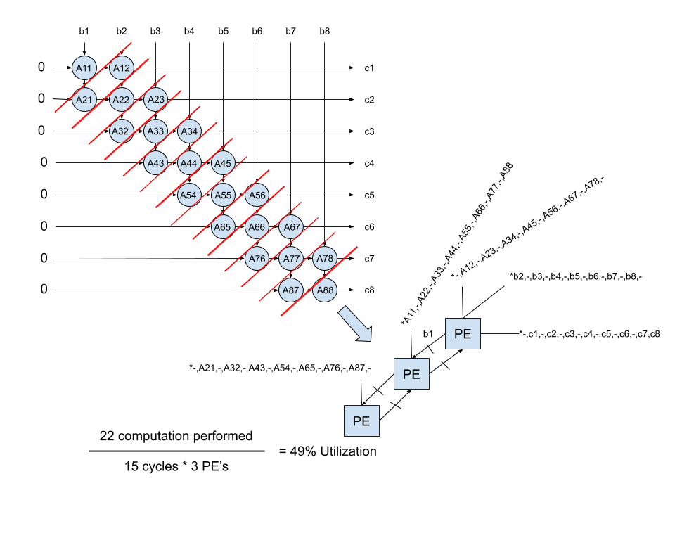
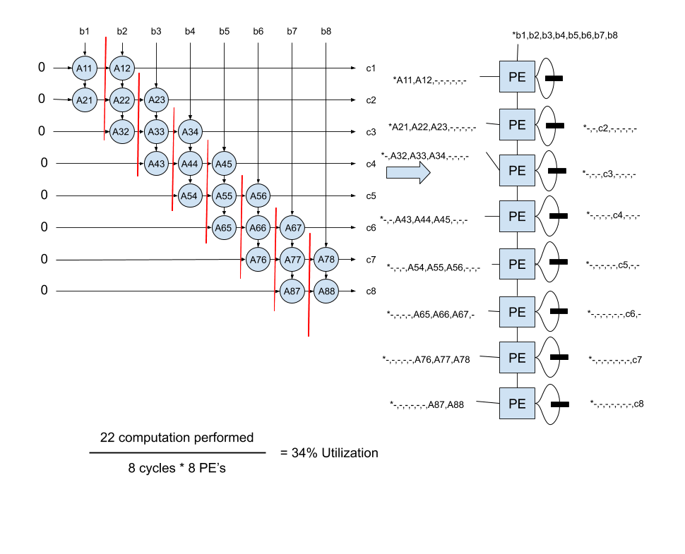
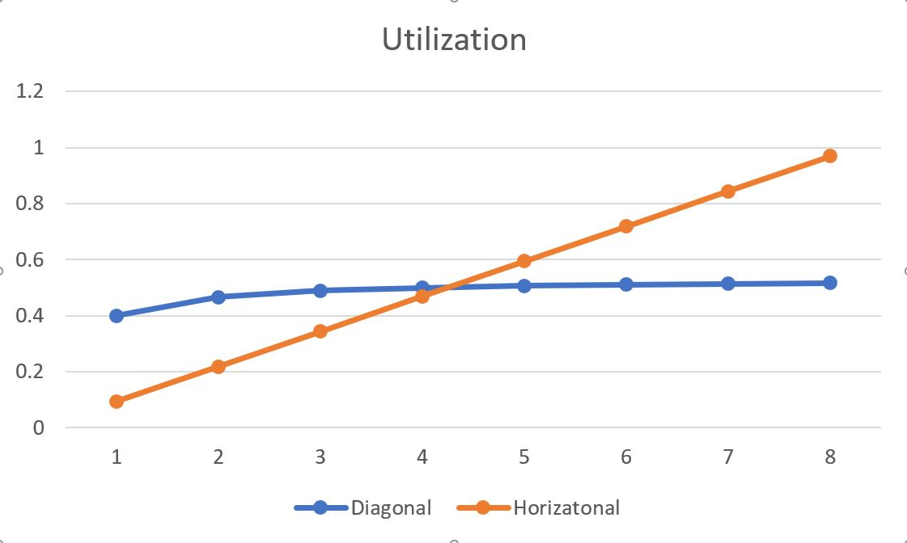
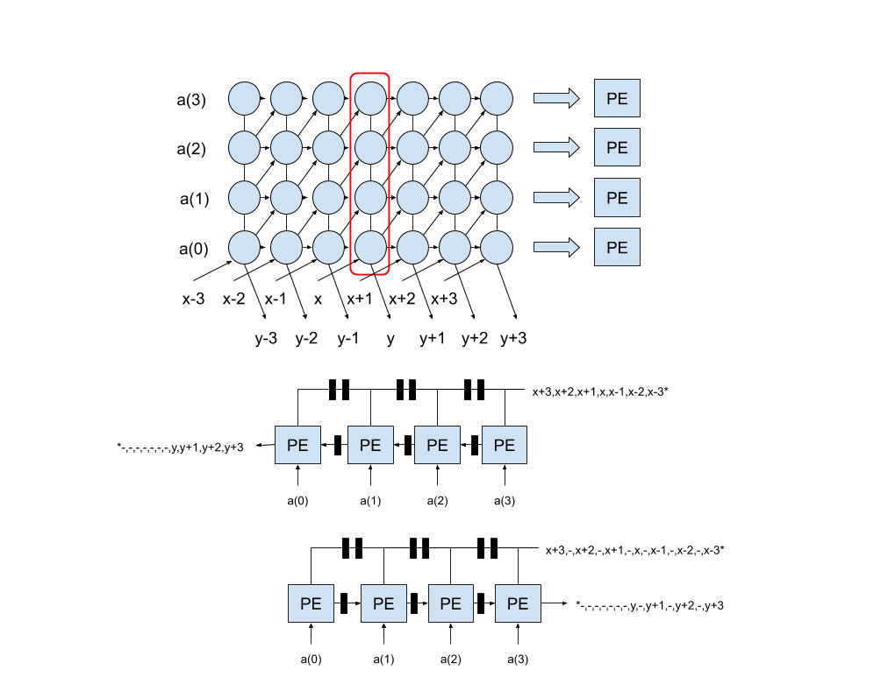

# Systolic Homeowrk 2

##Problem 1 & 2

##Problem 3

##Problem 4

The Horizatonal projection uses 8 PEs no matter what P value is used.
It becomes the better utilized method after a p value around 4.2.
Though the P value can only be odd values to make sense in a 8x8 matrix.
The Diagonal projection is better utilized with lower p values.

##Problem 5

I took the the vertical schedule from the previous homework becuase it doesn't care about the direction of the additions.
I then retimed the SFG in the two different directions.
Both have a latency of 8 cycles, but one requires the input to be spaced out from each other.

