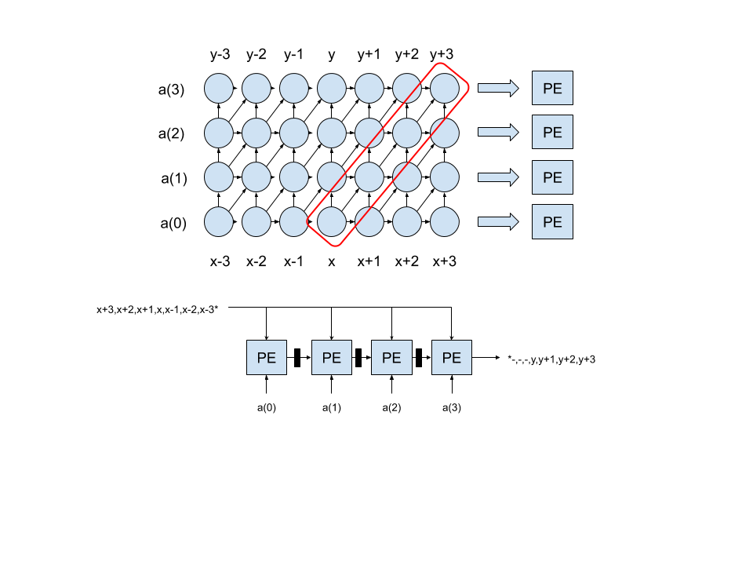
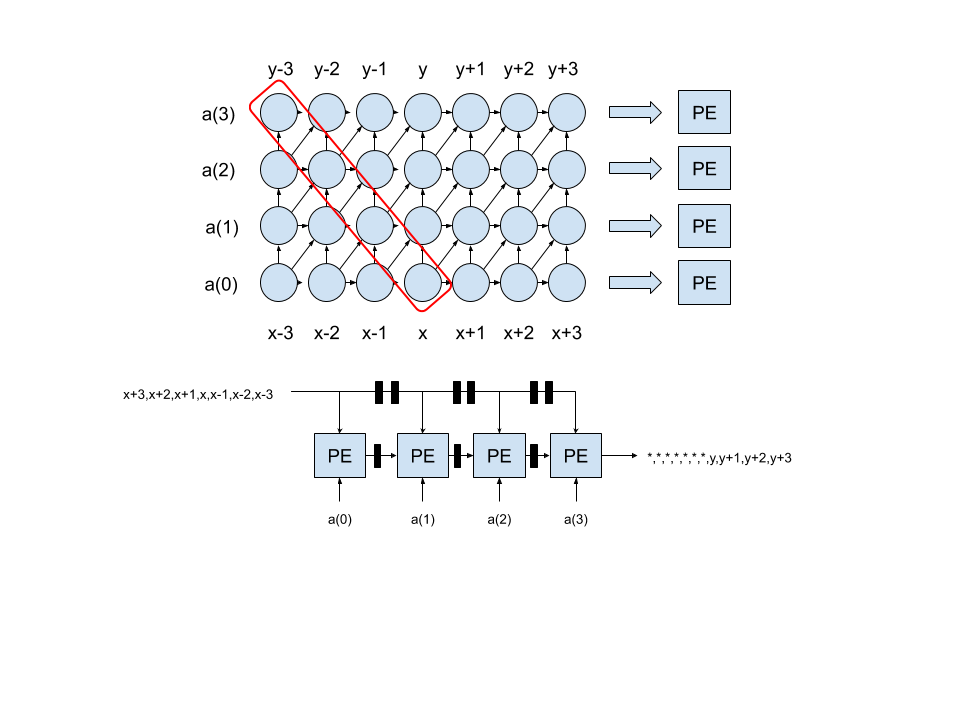
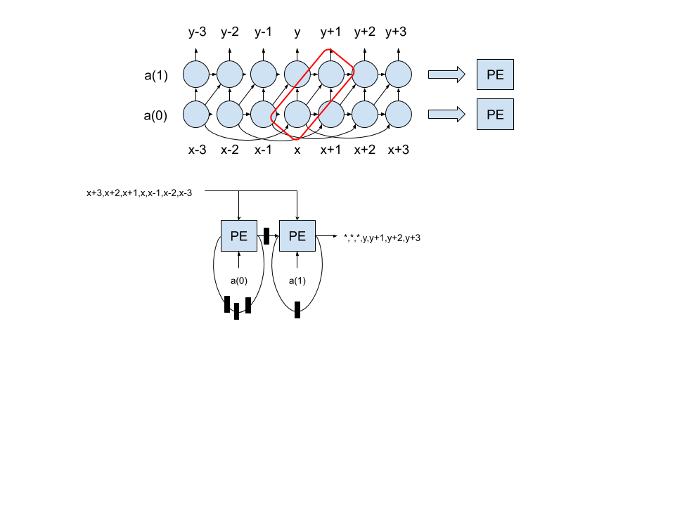
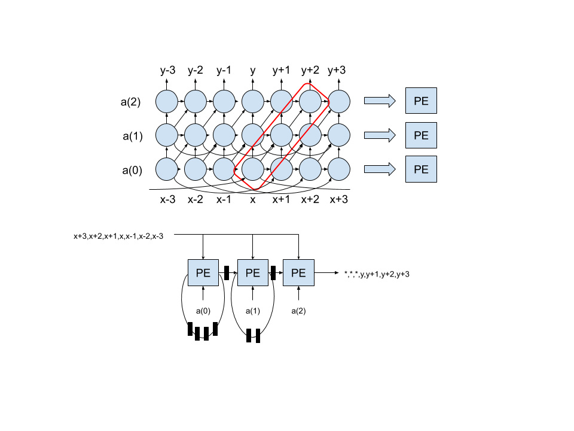

# Homework 1

## Problem 1

This DG and SFG show a possible projection and scheduling that allows for the incoming x value to be broadcasted to all the PEs.
The Vertical dependencies are associative and can all together go either up or down.
The criticall path of this SFG is the the the wire from x to the last PE, the PE caculation, and the final PE output to the Y output.
This design may have issue in scalling as the X will need to be broadcasted to several PEs.

Here is the VHDL for the PEs.
The X was padded with two 2 in front and behind to create a 14.2 fixed point value.
The final output of the FIR filter is 14.2 allowing for the best percision with a 16 bit outputs and no overflow.

pe.vhd

  
<pre><code class="vhdl">
library IEEE;
use IEEE.STD_LOGIC_1164.ALL;
use IEEE.NUMERIC_STD.ALL;

entity pe is
    Port ( 
           x : in STD_LOGIC_VECTOR (11 downto 0);
           b : in STD_LOGIC_VECTOR (15 downto 0);
           a : in STD_LOGIC_VECTOR (15 downto 0);
           y : out STD_LOGIC_VECTOR (15 downto 0));
end pe;

architecture Behavioral of pe is
signal product : std_logic_vector (31 downto 0);
signal pad_x : std_logic_vector (15 downto 0);
begin

pad_x &lt;= "00" &amp; x &amp; "00";
product &lt;= std_logic_vector(unsigned(pad_x)*unsigned(a));
y &lt;= std_logic_vector(unsigned(b) + unsigned(product(31 downto 16)));

end Behavioral;
</code></pre>

The simulation used a basic coefficients so it was easy to read.
Each coefficient was .5
Here is the waveform showing correct operation.

add waveform

The timing showed a slack of 2.300 ns with a period of 10 ns.
Each input and output had to be regitered and the coefficients were considered dynamic inputs so the tools would not optimize them.

## Problem 2
In this problem we used a vertical scheduling.
This required the x values to registered as they came in and for the computation to happen concurrently for the same y output.
The critical path for this is one multiplication of a PE and the ripple summation of the 4 products.
This will have the wrost timing of the 3 possible schedules.

The same VDHL files was used and simulation run (same results).
The timing showed a slack of -1.480 ns with a period of 10 ns.
This design did not meet timing.

## Problem 3

This SFG can be created two was (a) using a different diagonal scedule as shown in the image.
(b) adding retiming to problem 2, with additional registers added between each PE and additonal ones for the X values, you get the same resulting SFG.
This is sytolic and can easily be scaled up without an issue with timing.

The same VDHL files was used and simulation run (same results).
The timing showed a slack of 1.956 ns with a period of 10 ns.
Though this design did not get the best slack, it can probably be scaled and keep that same slack with problem 1 will soon face timing issues.

# Problem 4

With symmetrical coefficients, you can fold the DG as shown in the image below.
This reulst is an equation of (y = sum(a&lt;k&gt;*(x&lt;m-k&gt;+x&lt;k&gt;),k,0,N/2-1) when N is even.

# Problem 5

This is problem 4 but when N is odd.
This reulst is an equation of (y = a&lt;(N-1)/2&gt;x&lt;(N-1)/2&gt;+sum(a&lt;k&gt;(x&lt;m-k&gt;+x&lt;k&gt;),k,0,N/2-1) when N is even.

