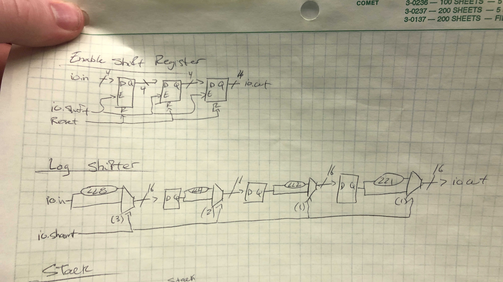
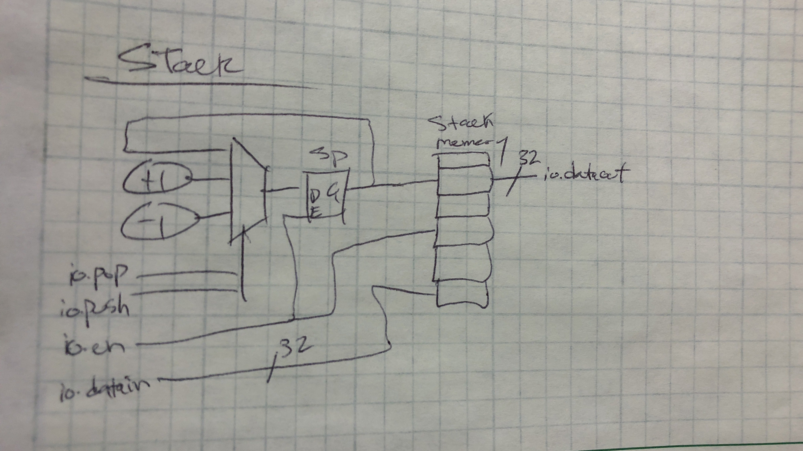
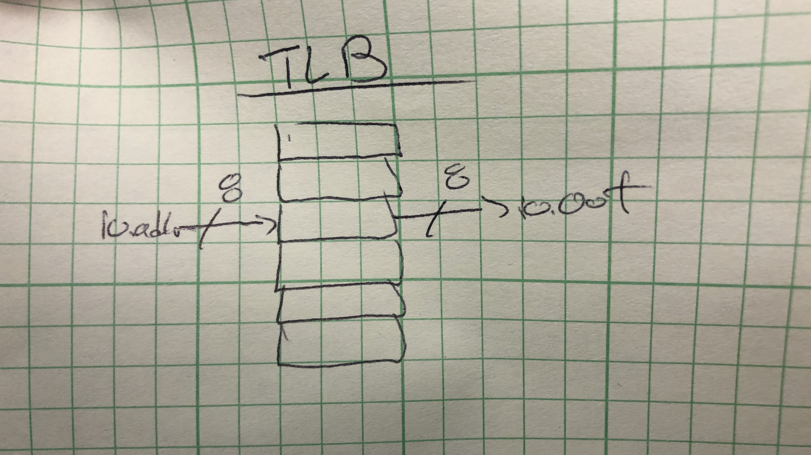

Andy and Corbin

##Part 1

###Chisel Bootcamp Summary

The bootcamp did provide a nice interactive tutorial to understand the tools.
It introduced simple concepts of building sequential and combination logic.
It did not explain the more complicated uses of Chisel3 or Scala.
You may have to go learn scala on its own.

Here are some examples I was curious about.

~~~
// Such concision! You'll learn what all this means later.
  val taps = Seq(io.in) ++ Seq.fill(io.consts.length - 1)(RegInit(0.U(8.W)))
  taps.zip(taps.tail).foreach { case (a, b) => when (io.valid) { b := a } }

  io.out := taps.zip(io.consts).map { case (a, b) => a * b }.reduce(_ + _)

val mmap = Seq(
            RegField.r(64, nFilters.U, RegFieldDesc("nFilters", "Number of filter lanes"))
        ) ++ taps.flatMap(_.map(t => RegField(8, t, RegFieldDesc("tap", "Tap"))))

    override val mem = Some(AXI4RegisterNode(
        AddressSet(0x0, 0xffffL), beatBytes = 8
    ))
~~~

| Name  | Peek % | Concept|
| ----------- | ----------- |----------- |
| Accumulator | 0%          | Reg variables and When() control logic|
| Adder       | 0%          | use a Generator for custom Widths     |
| Counter     | 5%          | Use Def as functions in the code      |
| DynamicMemorySearch | 25% | How to setup and use Lists            |
| LFSR16      | 40%         | Another example of when control logic and how to cat signals together |
| Max2        | 10%         | Mux function as well as expect and poke test functions|
| MaxN        | 30%         | For loops and reduceleft function examples |
| Memo        | 0%          | When control logic                    |
| Mul         | 25%         | Lookup table generation and use       |
| Mux4        | 10%         | Module Usage with a module            |
| RealGCD     | 50%         | When control logic                    |
| SingleEvenFilter | 40%    | Pipe modules together                 |
| VecShiftRegister | 40%    | Vec class usage                       |
| VecShiftRegisterSimple | 20% | Vec class usage                    |
| VecShitRegisterParam | 30% | Parameter in modules and For loop    |
| VendingMachine | 10%      | State Machine Example                 |
| VendingMachineSwitch | 40% | Switch statement Enum variable       |
| ByteSelector | -          | When, and bit selection               |
| EnableShiftRegister | Draw | elsewhen conditional usage           |
| Functionality | -         | Def (method/function) usage           |
| HiLoMultiplier | -        | Bit selection/multiply                |
| LogShifter  | Draw        | Barrel shifter mux logic              |
| Parity      | -           | State enum variable usage             |
| Stack       | Draw        | Memory and control logic              |
| Tlb         | Draw        | Lookup memory                         |
| VecSearch   | -           | Vec clase usage example               |
| Router      | -           | Class inheritance                     |
| RISC        | Draw        | Decoding instructions                 |
| Life        | Draw        | Class structure and What is foldRight? (Scala function) |

[uatMain.scala](https://github.com/AEW2015/522R/blob/master/pages/07.chisel3/uatMain.scala)

[uatTester.scala](https://github.com/AEW2015/522R/blob/master/pages/07.chisel3/uatTester.scala)

Here is the output of the testbench:

~~~
sbt:project_000> test:runMain hw.uatMain[warn] Multiple main classes detected.  Run 'show discoveredMainClasses' to see the list
[info] running hw.uatMain 
[info] [0.001] Elaborating design...
[info] [0.140] Done elaborating.
Total FIRRTL Compile Time: 343.2 ms
file loaded in 0.064968764 seconds, 75 symbols, 71 statements
[info] [0.001] SEED 1576281009099
[LOG] sending ==>  UInt<8>(70)
[info] [0.054] start bit
[info] [0.082] data bit 0
[info] [0.280] parity bit 0
[info] [0.305] stop bit 0
[LOG] sending ==>  UInt<8>(194)
[info] [0.326] start bit
[info] [0.351] data bit 0
[info] [0.553] parity bit 0
[info] [0.578] stop bit 0
[LOG] sending ==>  UInt<8>(253)
[info] [0.592] start bit
[info] [0.617] data bit 0
[info] [0.824] parity bit 0
[info] [0.850] stop bit 0
[LOG] sending ==>  UInt<8>(4)
[info] [0.863] start bit
[info] [0.889] data bit 0
[info] [1.091] parity bit 0
[info] [1.117] stop bit 0
[LOG] sending ==>  UInt<8>(203)
[info] [1.130] start bit
[info] [1.155] data bit 0
[info] [1.357] parity bit 0
[info] [1.382] stop bit 0
[LOG] sending ==>  UInt<8>(239)
[info] [1.396] start bit
[info] [1.422] data bit 0
[info] [1.624] parity bit 0
[info] [1.650] stop bit 0
[LOG] sending ==>  UInt<8>(208)
[info] [1.664] start bit
[info] [1.689] data bit 0
[info] [1.891] parity bit 0
[info] [1.917] stop bit 0
[LOG] sending ==>  UInt<8>(119)
[info] [1.930] start bit
[info] [1.955] data bit 0
[info] [2.157] parity bit 0
[info] [2.182] stop bit 0
[LOG] sending ==>  UInt<8>(218)
[info] [2.196] start bit
[info] [2.221] data bit 0
[info] [2.425] parity bit 0
[info] [2.450] stop bit 0
[LOG] sending ==>  UInt<8>(30)
[info] [2.464] start bit
[info] [2.489] data bit 0
[info] [2.694] parity bit 0
[info] [2.720] stop bit 0
test uat Success: 240 tests passed in 547805 cycles in 2.732882 seconds 200449.57 Hz
[info] [2.721] RAN 547800 CYCLES PASSED
[success] Total time: 4 s, completed Dec 13, 2019 4:50:12 PM
~~~

## Part 3

This was done together as a class.

## Conlusion

Chisel3 and Scala seem to be really useful, but has a large overhead to understand the language well.
This tutorial was not enough to use this tools effeicently. 
I need to understand more advance features.
I do not like how strict the development enviroment is and the difficulty in debugging the code.
The error message can be lacking.